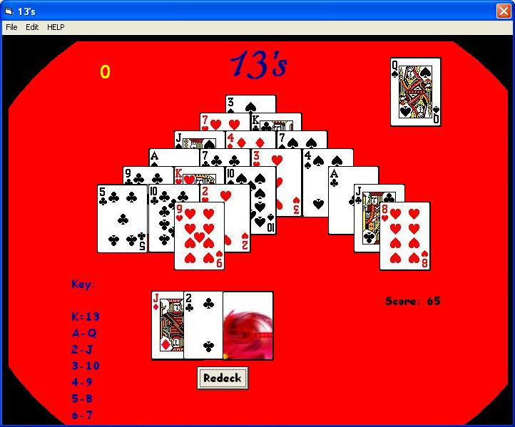



## Thirteen's \(SOLITAIR TYPE CARD GAME\)

### Description

Ok i was thought how to play this game... i don't know what it's called so i called it 13 because the object is to make 13 with a pair of cards. It's fun and my little sister likes to play it... i just wish i could make it an exe and if you want to use my some of my code please ask... Thank you Sehab Veljacic
 
### More Info
 

             |
---                |---
**Submitted On**   |2005-03-28 01:57:08
**By**             |[Sehab Veljacic](https://github.com/Planet-Source-Code/PSCIndex/blob/master/ByAuthor/sehab-veljacic.md)
**Level**          |Advanced
**User Rating**    |3.7 (11 globes from 3 users)
**Compatibility**  |VB 6\.0
**Category**       |[Games](https://github.com/Planet-Source-Code/PSCIndex/blob/master/ByCategory/games__1-38.md)
**World**          |[Visual Basic](https://github.com/Planet-Source-Code/PSCIndex/blob/master/ByWorld/visual-basic.md)
**Archive File**   |[Thirteen's1869003282005\.zip](https://github.com/Planet-Source-Code/sehab-veljacic-thirteen-s-solitair-type-card-game__1-59688/archive/master.zip)

